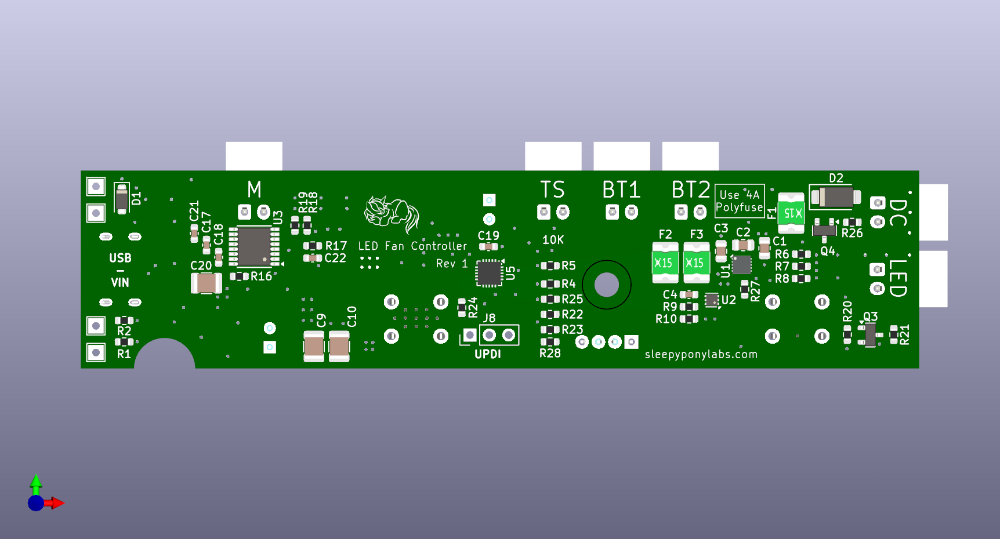
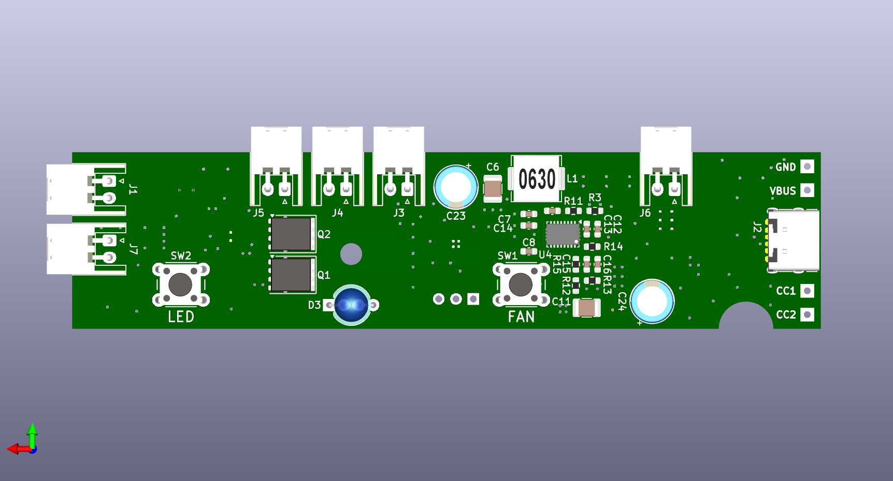

# LED Fan Controller

This is an open-source KiCAD design files for a retrofitting controller for cheap rechargeable USB fan with LED lights.

This board is an upgrade (I hope) for the old control board for lead-acid battery that broke down.

## Pictures

## Features

- 1A Charging via USB Type-C port or external 5V power.
- BQ25185DLH Battery charger IC
- BQ29701DSE Battery protection IC with extremely low RDS(on) MOSFET pair
- TPS61088RHL Boost converter from Vbat to 8V motor voltage
- DRV8876PWP Brushed DC Fan driver
- MCU control for fan and led levels.
	
## Revisions

We are currently at Revision 1. Changelog is below:

**Revision 1 (July 2024)**
 - Initial Design
 - Does work, but the Power Path feature on BQ25185DLH is not suitable for high current without cooling. Hits thermal limit in a few minutes.
 - Need to switch to another conventional 1A charger IC.
 - May need to remove DC jack connector as the existing board in the fan is not that good at handling the current.

## What is provided

**The schematics, PCB design, and an interactive BOM is provided.**

Hardware is licensed under `SPDX-License-Identifier: CERN-OHL-S-2.0`

Software is licensed under `SPDX-License-Identifier: GPL` (Firmware is WIP and will be uploaded later.)

Documentation is licensed under `SPDX-License-Identifier: CC-BY-SA-4.0`

## Ordering

You can export gerbers from this project and order the board yourself. You can also use the link below to directly order from Aisler.
https://aisler.net/p/YHUKIBMT

## Credits

 - AMPLF0630 inductor model by Aleksey Zablotskiy: https://grabcad.com/library/amplf-mpc-aspi-etc-smd-power-inductors-1
 - miniSMDC150F fuse model by Karol Novak: https://grabcad.com/library/minismdc150f-1
 - QFN packages model by Jason Traud: https://grabcad.com/library/qfn-packages-1
 - WSON-10 package model by Alex SAR: https://grabcad.com/library/sda10a-rev-a-wson-10-1
 - USB Type-C 6-pin SMD model by ni_ni: https://grabcad.com/library/usb-type-c-smd-6pin-1
 - VQFN-20 package model by Cristian Deenen: https://grabcad.com/library/vqfn-20-3x3mm-1
 